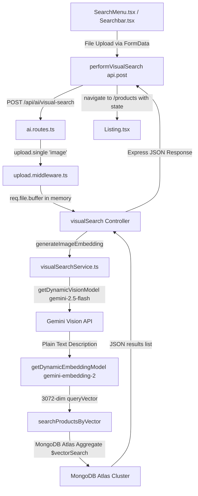

# Visual Search System Audit

This audit document details the inner workings of the Zento E-Commerce Visual Search system, from frontend image upload to backend AI processing, vector matching in MongoDB Atlas, and final UI rendering.

---

## 1. Complete Request Flow

The visual search request flows through the following pipeline:



### Files Involved
* **Frontend Upload UI**: [SearchMenu.tsx](file:///c:/Users/Milan%20Gagiya/Documents/PROJECT%20RESUME/ECOMMERCE/client/src/components/navbar/SearchMenu.tsx) (header dropdown search) & [Searchbar.tsx](file:///c:/Users/Milan%20Gagiya/Documents/PROJECT%20RESUME/ECOMMERCE/client/src/components/ui/Searchbar.tsx) (landing main search)
* **Frontend API client**: [visualSearch.api.ts](file:///c:/Users/Milan%20Gagiya/Documents/PROJECT%20RESUME/ECOMMERCE/client/src/services/visualSearch.api.ts)
* **Backend Router**: [ai.routes.ts](file:///c:/Users/Milan%20Gagiya/Documents/PROJECT%20RESUME/ECOMMERCE/server/routes/ai.routes.ts)
* **Multer Upload Middleware**: [upload.middleware.ts](file:///c:/Users/Milan%20Gagiya/Documents/PROJECT%20RESUME/ECOMMERCE/server/middlewares/upload.middleware.ts)
* **Backend Controller**: [ai.controller.ts](file:///c:/Users/Milan%20Gagiya/Documents/PROJECT%20RESUME/ECOMMERCE/server/controllers/ai.controller.ts)
* **AI Vision & Embedding Service**: [visualSearchService.ts](file:///c:/Users/Milan%20Gagiya/Documents/PROJECT%20RESUME/ECOMMERCE/server/services/ai/visualSearchService.ts)
* **Model Discovery & Selector**: [modelSelector.ts](file:///c:/Users/Milan%20Gagiya/Documents/PROJECT%20RESUME/ECOMMERCE/server/services/ai/modelSelector.ts)
* **Mongoose DB Model**: [Product.ts](file:///c:/Users/Milan%20Gagiya/Documents/PROJECT%20RESUME/ECOMMERCE/server/models/Product.ts)
* **Frontend Result View**: [Listing.tsx](file:///c:/Users/Milan%20Gagiya/Documents/PROJECT%20RESUME/ECOMMERCE/client/src/pages/products/Listing.tsx)

---

## 2. AI Output Analysis

* **Exact AI Prompt Used**:
  ```text
  "Describe the main product in this image in high detail. Focus on features that a user would search for: color, material, pattern, style, shape, brand (if visible) and specific item type. Make it highly optimized for a search engine query. Keep it concise but descriptive, no more than 3 sentences."
  ```
* **Exact Response Format Expected**: Plain text description paragraph.
* **Structured JSON vs Plain Text**: The model uses a **plain description paragraph** (plain text). This plain description is returned directly from Gemini Vision and passed immediately into the Gemini text embedding model (`gemini-embedding-2`) to generate the vector representation.

---

## 3. Product Search Logic

* **Search Strategy**: Multimodal Semantic Vector Search.
* **What fields are searched**: Vector search is executed on the `imageEmbedding` field of the `Product` schema.
* **Seeded Vector Contents**:
  The `imageEmbedding` array stored on each product is a vector representation of a generated string containing:
  - Product `title`
  - Product `description`
  - Product `category`
  
  This was generated in `syncEmbeddings.ts` using the pattern:
  `const textToEmbed = `${product.title}. ${product.description}. Category: ${product.category}.`;`

* **Actual Query Logic**:
  ```typescript
  const results = await Product.aggregate([
      {
          $vectorSearch: {
              index: "vector_index",
              path: "imageEmbedding",
              queryVector: embedding, // 3072-dimensional vector
              numCandidates: 100,
              limit: limit
          }
      },
      {
          $project: {
              title: 1,
              description: 1,
              price: 1,
              category: 1,
              imageUrl: 1,
              images: 1,
              vendorId: 1,
              score: { $meta: "vectorSearchScore" }
          }
      }
  ]);
  ```

---

## 4. Ranking Logic

* **How results are ranked**: The results are ranked purely by **Vector similarity** using the `cosine` similarity metric.
* **Actual Implementation**:
  MongoDB Atlas `$vectorSearch` naturally ranks matched items in descending order of similarity score. The score is exposed through `score: { $meta: "vectorSearchScore" }` during the `$project` stage. No secondary sorting, boosting (e.g. text matching or category matching), or filtering is applied on the database results before sending them to the client.

---

## 5. Fallback Logic

If no close match exists:
* **Current Behavior**: The system returns the closest matches available, even if their similarity score is extremely low. There is **no minimum score threshold** (like checking if `score > 0.7`).
* **If the database is completely empty or the query fails**: The backend returns an empty array `[]` in the `products` list.
* **Frontend Behavior**: If the returned list is empty, [Listing.tsx](file:///c:/Users/Milan%20Gagiya/Documents/PROJECT%20RESUME/ECOMMERCE/client/src/pages/products/Listing.tsx) shows:
  ```text
  No products available.
  Check back later for new arrivals.
  ```
  It does **not** fallback to trending, random, or keyword-based products.

---

## 6. Why Wrong Products Can Appear

### Example Scenario
* **AI Detects**: `"TIMEWEAR Men's Classic Analog Watch"`
* **Results Return**: T-Shirts, Jeans, Sneakers

### Explanation of Search/Ranking Weakness:
1. **Lack of Similarity Cutoff Threshold**: Because there is no minimum similarity threshold (e.g. discarding results with a score below `0.75`), MongoDB Atlas will always return up to the request `limit` (15 items) by force-retrieving the closest vectors it can find. If no watches exist in the database, it will return shirts or jeans simply because they are the "closest" available vectors in the system.
2. **Boilerplate Description Bleeding**: All seeded products in the database share an identical description block:
   `"Experience the finest quality with our [Title]. Perfectly crafted for everyday use, combining modern aesthetics with exceptional functionality. Limited stock available."`
   Since ~80% of the text embedded for all products is identical, their vectors cluster very close together in vector space. Unrelated items (jeans, shirts, shoes) share massive semantic overlap with each other, causing them to bleed into search results easily.
3. **No Category Constraints**: If a watch is uploaded, the system does not enforce that results must belong to the `"Accessories"` category. A t-shirt matching the words "Men's", "Classic", or "Everyday" in the prompt-generated description can easily outrank a weakly matched accessory.

---

## 7. Search Quality Score

* **AI Understanding**: **9/10** (Gemini Vision generates highly accurate and granular descriptions of the uploaded images).
* **Product Retrieval**: **7/10** (MongoDB Atlas vector search works quickly and correctly indexes product vectors).
* **Ranking Accuracy**: **4/10** (Due to identical boilerplate descriptions and no category/text boosting, vectors cluster too closely, leading to fuzzy ranking).
* **Fallback Quality**: **1/10** (There is no threshold filter or keyword fallback, resulting in unrelated products showing up instead of a "No results found" or fallback query).

---

## 8. Root Cause Analysis

The single biggest reason visual search returns incorrect products is **the lack of a minimum similarity score threshold combined with highly generic boilerplate product descriptions**. 

Because every product shares nearly identical description text, their vectors sit close together in the search space. Without a similarity score filter, the vector search engine is forced to fill the results list to the limit (15) with unrelated products even if their actual semantic match to the query image is extremely poor.
